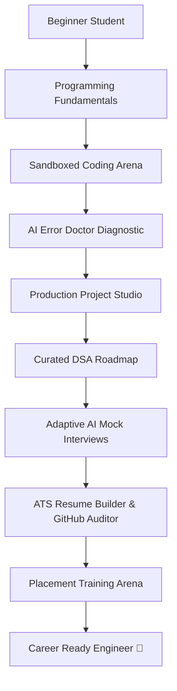

# CodePath – AI Programming & Career Assistant for Engineering Students

> **"Learn to Code. Build Projects. Become Career Ready."**

CodePath is a production-grade, full-stack SaaS platform built specifically for engineering students navigating the challenging transition from academic programming theory to industry-standard software engineering careers.

---

## 🌟 Vision & Learning Journey

CodePath structures the student lifecycle into a clear, continuous engineering progression:



---

## 🛠️ Architecture & Tech Stack

CodePath is engineered with modern cloud-native separation of concerns:

| Layer | Technology | Hosting Target |
| :--- | :--- | :--- |
| **Frontend** | **Next.js 14** (App Router, TypeScript, Tailwind CSS, Monaco Editor, Lucide React, TanStack Query) | **Vercel** |
| **Backend** | **Python 3.11 FastAPI** (Pydantic v2, SQLAlchemy 2.0, Alembic, Sandboxed Code Runner) | **Render** |
| **Database** | **Supabase PostgreSQL** (37 normalized tables with Row Level Security, Triggers & Vector indices) | **Supabase Cloud** |
| **Auth & Storage** | **Supabase Auth** (JWT / OAuth), Supabase Object Storage (Resumes, Project Artifacts) | **Supabase Cloud** |
| **AI Intelligence** | Multi-Provider Engine (Google Gemini 1.5, OpenAI GPT-4o, Local Socratic Fallback) | Cloud APIs |
| **CI/CD** | GitHub Actions (Linting, Typechecks, Unit/Integration Pytest, Vercel/Render Deploy Hooks) | GitHub Actions |

---

## 🚀 Key Modules & Capabilities

1. **AI Socratic Programming Mentor (`/mentor`)**
   - Hint-first pedagogy: guides students through questions rather than dumping full answers.
   - Conceptual breakdowns, syntax explanations, and interactive hints.

2. **AI Error Doctor (`/error-doctor`)**
   - Plain-English compiler/runtime error diagnostics (Python, Java, C, C++, JavaScript).
   - "Why it happened", "How to fix it", fixed code snippet, and prevention tips.

3. **Interactive Course Catalog & Lessons (`/learn`)**
   - Modular curriculums for Python, Java, C, C++, JavaScript, and SQL.
   - Live in-browser code editor with sandboxed execution.

4. **Coding Practice Arena (`/practice`)**
   - LeetCode-style problem suite categorized by difficulty, topic, and tags.
   - Multiple test case verification with stdout/stderr inspection and complexity analysis.

5. **DSA Roadmap (`/dsa`)**
   - Comprehensive NeetCode/Striver style progression: Arrays, Two Pointers, Trees, Graphs, Dynamic Programming.
   - Algorithm visualizers, time/space complexity notes, and interview frequency badges.

6. **Production Project Studio (`/projects`)**
   - Step-by-step full-stack and systems project blueprints.
   - Architecture diagrams, milestone checklist, database design, and GitHub showcase guides.

7. **AI Mock Interview Simulator (`/interview`)**
   - Technical, Behavioral, and System Design interview simulations.
   - Real-time scoring, STAR-method rubric assessment, and improvement roadmaps.

8. **Career Readiness Engine & Dashboard (`/dashboard`, `/career`)**
   - Live **Career Readiness Score (0-100%)** calculated across 6 pillars:
     - DSA Mastery (25%)
     - Projects & Architecture (25%)
     - Practice Consistency (15%)
     - Course Completion (15%)
     - Mock Interview Performance (10%)
     - Resume & GitHub Profile (10%)
   - Role-specific roadmaps: Full Stack, Backend, Frontend, Data Engineering, AI/ML, DevOps.

9. **ATS Resume Builder & GitHub Portfolio Auditor (`/resume`, `/github`)**
   - LaTeX-grade engineering resume builder with live ATS keyword matching and score gauge.
   - Automated GitHub repository auditor: evaluates README quality, commit cadence, and showcase hygiene.

10. **Campus Placement Arena (`/placement`)**
    - Timed company-specific mock placement drives (TCS NQT, Infosys, Amazon, Google, Startups).
    - Sectional timers: Quantitative Aptitude, Logical Reasoning, Verbal, and Core CS/Coding.

11. **Community Discussions (`/community`)**
    - Collaborative forum for peer code reviews, interview experiences, and solution discussions.

12. **Admin & Instructor Portal (`/admin`)**
    - Platform-wide analytics, course/problem management, system telemetry, and user management.

---

## 📁 Repository Structure

```
├── .github/
│   └── workflows/          # CI/CD Workflows (ci.yml, cd.yml)
├── backend/
│   ├── alembic/            # Database migrations
│   ├── app/
│   │   ├── api/v1/         # FastAPI Route Controllers (15 modules)
│   │   ├── core/           # Config, Database, Logging, Security (JWT/RLS)
│   │   ├── middleware/     # Request ID, Error Handling
│   │   ├── models/         # SQLAlchemy ORM Models (37 tables)
│   │   ├── schemas/        # Pydantic v2 Request/Response Models
│   │   ├── services/       # AI Service, Code Sandbox, Readiness Engine, Seeder
│   │   └── main.py         # Application Entrypoint & Lifespan
│   ├── tests/              # Pytest Unit and Integration Test Suite
│   ├── Dockerfile          # Multi-stage production container
│   ├── requirements.txt    # Locked Python dependencies
│   └── pytest.ini          # Test configuration
├── frontend/
│   ├── app/                # Next.js 14 App Router Pages
│   ├── components/         # Reusable UI & CodeEditor Components
│   ├── lib/                # Supabase Client, Utility Functions
│   ├── services/           # Centralized Typed API Client
│   ├── types/              # TypeScript Shared Interface Definitions
│   └── package.json        # Frontend Dependencies
├── supabase/
│   ├── migrations/         # PostgreSQL DDL with RLS Policies & Triggers
│   └── seed/               # Production Seed Data (Problems, Courses, DSA)
├── docs/                   # Architectural & System Documentation
├── docker-compose.yml      # Local container orchestration
└── .env.example            # Environment variables specification
```

---

## ⚡ Quickstart & Local Development

### Prerequisites
- **Node.js**: v18.17.0+ (Node 20+ recommended)
- **Python**: v3.10+ (Python 3.11 recommended)
- **Git**

### 1. Clone & Configure Environment
```bash
git clone https://github.com/your-org/codepath.git
cd codepath

# Copy environment variables
cp .env.example .env
cp .env.example backend/.env
cp .env.example frontend/.env.local
```

### 2. Run Backend (FastAPI)
```bash
cd backend

# Create virtual environment
python -m venv venv
# On Windows:
venv\Scripts\activate
# On macOS/Linux:
source venv/bin/activate

# Install dependencies
pip install -r requirements.txt

# Run migrations / verify tests
pytest

# Start development server
uvicorn app.main:app --reload --port 8000
```
- Backend API Docs: `http://localhost:8000/docs`
- Health Check: `http://localhost:8000/health`

### 3. Run Frontend (Next.js)
```bash
cd ../frontend

# Install dependencies
npm install

# Start development server
npm run dev
```
- Web Application: `http://localhost:3000`

---

## 🧪 Testing & Verification

### Run Backend Tests (26 Unit & Integration Tests)
```bash
cd backend
pytest -v
```

### Run Frontend Linting, Typecheck & Production Build
```bash
cd frontend
npm run lint          # Strict ESLint checks (0 warnings/errors)
npm run typecheck     # Strict TypeScript typechecking (tsc --noEmit)
npm run build         # Next.js 14 production bundle generation
```

---

## 🚢 Deployment Guide

- **Backend (Render Web Service)**: Connect Git repository, set root directory to `backend/` or select `Dockerfile`, and configure:
  - `PORT`: Automatically provided by Render
  - `ENVIRONMENT`: `production`
  - `SUPABASE_URL`: `https://zwagbbmxckiinpacawkr.supabase.co`
  - `SUPABASE_SECRET_KEY`: `[Your Supabase Service Role Key]`
  - `CORS_ORIGINS`: `https://codepath-frontend.vercel.app,http://localhost:3000`
  - Start command (if native Python): `uvicorn app.main:app --host 0.0.0.0 --port $PORT`

- **Frontend (Vercel Project)**: Import repository root with root directory set to `frontend/`, configure Framework Preset: `Next.js`:
  - `NEXT_PUBLIC_API_URL`: `https://codepath-backend.onrender.com/api/v1`
  - `NEXT_PUBLIC_SUPABASE_URL`: `https://zwagbbmxckiinpacawkr.supabase.co`
  - `NEXT_PUBLIC_SUPABASE_PUBLISHABLE_KEY`: `sb_publishable_ZyOP2Eu5R4C1cMDLhPWjXw_BqUMOCcK`

- **Database (Supabase)**: Apply `supabase/migrations/20260101000000_initial_schema.sql`, `20260101000001_storage_resumes.sql`, and `supabase/seed/seed_data.sql` in the Supabase SQL Editor.

Refer to [`docs/deployment.md`](./docs/deployment.md) for detailed step-by-step instructions.

---

## 📄 License & Contributing

Built with ❤️ for engineering students worldwide. Distributed under the MIT License.
