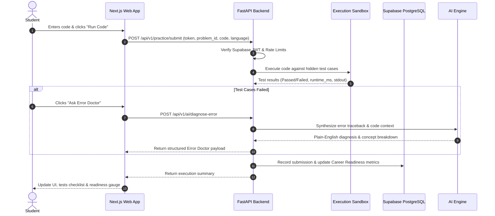

# System Architecture & Technical Design

## 1. System Overview

CodePath is designed as a decoupled, multi-tier SaaS platform optimizing for developer experience, low latency, robust security, and cloud scalability.

```
+-----------------------------------------------------------------------------------+
|                                  CLIENT LAYER                                     |
|                                                                                   |
|   Next.js 14 Web Application (App Router, React Server & Client Components)       |
|   Tailwind CSS  *  Monaco Code Editor  *  Lucide Icons  *  TanStack Query         |
+------------------------------------------+----------------------------------------+
                                           | HTTPS / JSON
                                           v
+-----------------------------------------------------------------------------------+
|                               API GATEWAY & ROUTING                               |
|                                                                                   |
|   FastAPI v1 API Router  *  CORS Middleware  *  X-Request-ID Correlation          |
|   JWT Verification Middleware  *  Structured Error Handler                        |
+---------------------+--------------------+--------------------+-------------------+
                      |                    |                    |
                      v                    v                    v
+---------------------+  +-----------------+  +-----------------+  +----------------+
| LEARNING & PRACTICE |  | CAREER & RESUME |  | AI ORCHESTRATOR |  | SANDBOX ENGINE |
|                     |  |                 |  |                 |  |                |
| - Courses & Lessons |  | - Readiness Calc|  | - Socratic Hint |  | - Safe Subproc |
| - Problems Arena    |  | - ATS Scoring   |  | - Error Doctor  |  | - Blacklist Sec|
| - DSA Roadmaps      |  | - Placement Sim |  | - Mock Intervw  |  | - 8s Timeout   |
| - Community Q&A     |  | - GitHub Audit  |  | - Code Reviewer |  | - Mem/Disk Iso |
+----------+----------+  +--------+--------+  +--------+--------+  +-------+--------+
           |                      |                    |                   |
           +----------------------+----------+---------+                   |
                                             |                             |
                                             v                             v
+--------------------------------------------+--+  +-------------------------------+
|             DATA & AUTH PERSISTENCE           |  |      EPHEMERAL RUNTIMES       |
|                                               |  |                               |
|  Supabase PostgreSQL (37 Tables with RLS)     |  |  Python, Java, C++, JS, SQL   |
|  Supabase Auth (JWT Claims, RBAC Roles)       |  +-------------------------------+
|  Supabase Storage (Resumes, Project Artifacts)|
+-----------------------------------------------+
```

---

## 2. Component Breakdown

### 2.1 Frontend (Next.js 14)
- **Framework**: Next.js 14 with App Router.
- **Client/Server Splitting**: Static pages (marketing, terms, about) are pre-rendered server components. Dynamic arenas (code editor, AI mentor chat, interactive placement tests) utilize dedicated `'use client'` boundaries with optimistic UI updates.
- **State & Data Management**: Centralized client singleton in `services/api.ts` orchestrates HTTP communication with typed generic envelopes (`ApiResponse<T>`).
- **Code Editing**: Integrated `@monaco-editor/react` configured with dynamic language mode switching (Python, JavaScript, C++, C, Java, SQL), theme toggling (VS Code Dark), and error markers.

### 2.2 Backend (FastAPI & SQLAlchemy)
- **Framework**: Python 3.11 with FastAPI and Pydantic v2.
- **Data Access**: SQLAlchemy 2.0 ORM with asynchronous-ready architecture, declarative models, and schema validation.
- **Lifespan Management**: Seamless startup and shutdown hook initializing DB connection pools and idempotent seeding.
- **Error Propagation**: Global `AppException` and standard HTTP exception handlers guarantee that all error responses conform to `{ "success": false, "error": { "code": "...", "message": "...", "details": ... } }`.

### 2.3 Sandboxed Code Execution Engine (`code_executor.py`)
- Executes student code in a controlled subprocess environment.
- **Security Protections**:
  1. Static analysis scanner rejecting malicious tokens (`import os`, `subprocess`, `sys.exit`, `eval`, `exec`, `open`, `socket`, `__import__`).
  2. Isolated execution directories created per-run via `tempfile.mkdtemp` and cleaned up with `shutil.rmtree` in a `finally` block.
  3. Execution timeout enforced at 8.0 seconds to prevent infinite loops.
  4. Memory and file size guards preventing fork-bombs and out-of-disk conditions.

### 2.4 AI Mentorship Engine (`ai_service.py`)
- Multi-provider architecture with automatic fallback:
  1. Primary: Google Gemini 1.5 Pro / Flash.
  2. Secondary: OpenAI GPT-4o / GPT-3.5 Turbo.
  3. Offline/Local: Algorithmic heuristic mentor providing immediate rule-based assistance without external API keys.
- Enforces a **Socratic pedagogical rule**: Never supply immediate, copy-pasteable answers. Instead, diagnose mental models, provide hints in progressive tiers, and reinforce fundamental principles.

---

## 3. Data Flow Diagram



---

## 4. Scalability & Availability Strategy

1. **Stateless Backend**: All FastAPI worker processes are completely stateless, allowing horizontal scaling behind Render's load balancer.
2. **Database Connection Pooling**: SQLAlchemy connection pool configured with recycling and pre-ping checks to prevent stale connections during idle cloud hours.
3. **Edge Asset Delivery**: Static assets, compiled JavaScript, and Monaco web-workers are distributed globally across Vercel's Edge CDN.
