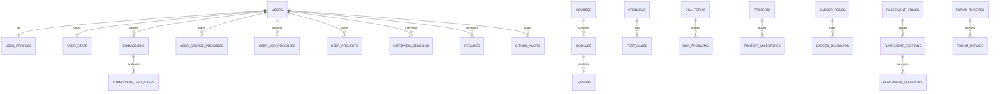

# Database Schema & Data Models

## 1. Overview & Principles

CodePath utilizes **PostgreSQL** hosted on **Supabase**. The schema is strictly normalized across 37 tables organized into functional domains:
- Identity & Profiles (`users`, `user_profiles`, `user_stats`)
- Learning & Curriculums (`courses`, `modules`, `lessons`, `user_course_progress`, `user_lesson_progress`)
- Practice & Problems (`problems`, `test_cases`, `submissions`, `submission_test_cases`)
- Data Structures & Algorithms (`dsa_topics`, `dsa_problems`, `user_dsa_progress`)
- Project Studio (`projects`, `project_milestones`, `user_projects`, `user_milestone_progress`)
- Career Readiness & Roadmaps (`career_roles`, `career_skills`, `career_roadmaps`, `user_career_readiness`)
- Mock Interviews (`interview_sessions`, `interview_questions`, `interview_evaluations`)
- Placement Arena (`placement_drives`, `placement_sections`, `placement_questions`, `placement_attempts`)
- Resume & GitHub (`resumes`, `resume_evaluations`, `github_audits`)
- Community & Discussions (`forum_categories`, `forum_threads`, `forum_replies`)
- Gamification & AI (`achievements`, `user_achievements`, `ai_interactions`, `notifications`)

---

## 2. Entity-Relationship Model



---

## 3. Core Table Specifications

### 3.1 Users & Identity
```sql
CREATE TABLE public.users (
    id UUID PRIMARY KEY REFERENCES auth.users(id) ON DELETE CASCADE,
    email VARCHAR(255) NOT NULL UNIQUE,
    full_name VARCHAR(255) NOT NULL,
    avatar_url TEXT,
    role VARCHAR(50) DEFAULT 'student' CHECK (role IN ('student', 'mentor', 'admin')),
    college_name VARCHAR(255),
    graduation_year INT,
    created_at TIMESTAMPTZ DEFAULT NOW(),
    updated_at TIMESTAMPTZ DEFAULT NOW()
);
```

### 3.2 Problems & Testing Arena
```sql
CREATE TABLE public.problems (
    id UUID PRIMARY KEY DEFAULT gen_random_uuid(),
    title VARCHAR(255) NOT NULL,
    slug VARCHAR(255) NOT NULL UNIQUE,
    description TEXT NOT NULL,
    difficulty VARCHAR(20) NOT NULL CHECK (difficulty IN ('easy', 'medium', 'hard')),
    category VARCHAR(100) NOT NULL,
    starter_code JSONB NOT NULL DEFAULT '{}',
    solution_code JSONB,
    hints JSONB DEFAULT '[]',
    tags TEXT[] DEFAULT '{}',
    created_at TIMESTAMPTZ DEFAULT NOW()
);

CREATE TABLE public.test_cases (
    id UUID PRIMARY KEY DEFAULT gen_random_uuid(),
    problem_id UUID NOT NULL REFERENCES public.problems(id) ON DELETE CASCADE,
    input TEXT NOT NULL,
    expected_output TEXT NOT NULL,
    is_hidden BOOLEAN DEFAULT FALSE,
    order_index INT DEFAULT 0
);
```

### 3.3 Career Readiness Tracking
```sql
CREATE TABLE public.user_career_readiness (
    id UUID PRIMARY KEY DEFAULT gen_random_uuid(),
    user_id UUID NOT NULL REFERENCES public.users(id) ON DELETE CASCADE UNIQUE,
    overall_score INT DEFAULT 0 CHECK (overall_score BETWEEN 0 AND 100),
    dsa_score INT DEFAULT 0 CHECK (dsa_score BETWEEN 0 AND 100),
    project_score INT DEFAULT 0 CHECK (project_score BETWEEN 0 AND 100),
    practice_score INT DEFAULT 0 CHECK (practice_score BETWEEN 0 AND 100),
    course_score INT DEFAULT 0 CHECK (course_score BETWEEN 0 AND 100),
    interview_score INT DEFAULT 0 CHECK (interview_score BETWEEN 0 AND 100),
    resume_score INT DEFAULT 0 CHECK (resume_score BETWEEN 0 AND 100),
    target_role VARCHAR(100),
    last_computed_at TIMESTAMPTZ DEFAULT NOW()
);
```

---

## 4. Row Level Security (RLS) Policies

All tables implement strict Supabase Row Level Security. Examples:
- **Public Read, Admin Write**: Catalogues (`courses`, `problems`, `dsa_topics`, `career_roles`).
- **Owner Access**: User private data (`user_profiles`, `submissions`, `resumes`, `interview_sessions`).
```sql
ALTER TABLE public.submissions ENABLE ROW LEVEL SECURITY;

CREATE POLICY "Users can read own submissions"
ON public.submissions FOR SELECT
USING (auth.uid() = user_id);

CREATE POLICY "Users can create own submissions"
ON public.submissions FOR INSERT
WITH CHECK (auth.uid() = user_id);
```

---

## 5. Migration Strategy

- **Tooling**: Alembic for Python ORM models alongside Supabase CLI declarative migrations (`supabase/migrations/`).
- **Idempotency**: All migrations use `IF NOT EXISTS` constructs and trigger-based `updated_at` synchronization.
- **Initial Seeding**: The migration directory contains `supabase/seed/seed_data.sql`, automatically populating foundational courses, LeetCode problems, career paths, and mock placement tests.
